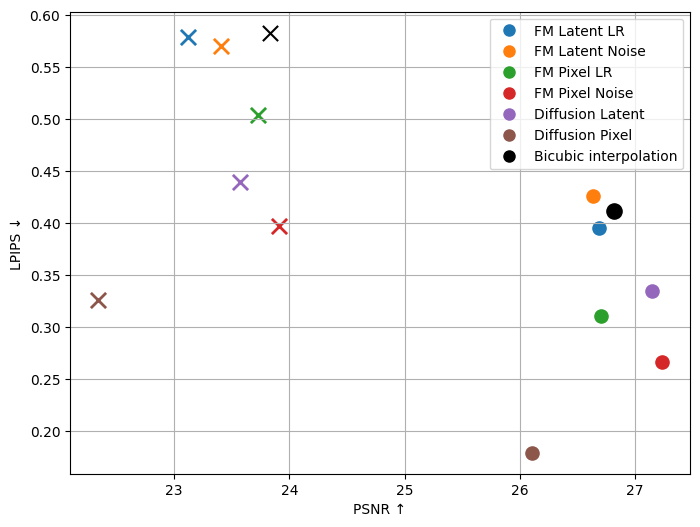

# SISR: Diffusion and Flow Matching for Image Super-Resolution

This repository is the codebase for a master's thesis comparing **diffusion-based** and **flow matching** generative models for Single-Image Super-Resolution (SISR), implemented in both pixel-space and latent-space on a shared NAFNet backbone.


## Repository structure

- `Diffusion/` latent/pixel diffusion branch based on [image-restoration-sde](https://github.com/Algolzw/image-restoration-sde)
- `flow_matching_NAFNet/` latent/pixel flow matching branch, based on [flow matching](https://github.com/facebookresearch/flow_matching)
- `metrics/` shared evaluation scripts (LPIPS, PSNR; SSIM; DISTS, MS-SSIM, FID)

## Setup

```bash
conda env create -f environment.yml
conda activate SISR
```

## Usage

### Diffusion

Run from `Diffusion/image-restoration-sde/codes/config/sisr/`:

```bash
python train.py -opt options/train/latent_final.yml
python validation.py -opt options/test/latent_val_test.yml
```

### Flow Matching

Run from `flow_matching_NAFNet/`:

```bat
./train.bat
./validate.bat
```

Edit the `REPO` / `DATA_ROOT` variables near the top of each `.bat` file to point at your local paths before running.

## Results

Across 4x and 8x super-resolution, flow matching in pixel-space gave the strongest overall perception-distortion balance among the tested configurations, while diffusion remained stronger on pure perceptual quality.



## Acknowleddgements

Built on top of:

- [image-restoration-sde](https://github.com/Algolzw/image-restoration-sde) (IR-SDE / Refusion) - diffusion branch base
- [flow matching](https://github.com/facebookresearch/flow_matching) - flow matching branch base

## Links

Master's thesis [Latent diffusion model for image super-resolution](https://urn.fi/URN:NBN:fi-fe20260618100380)
